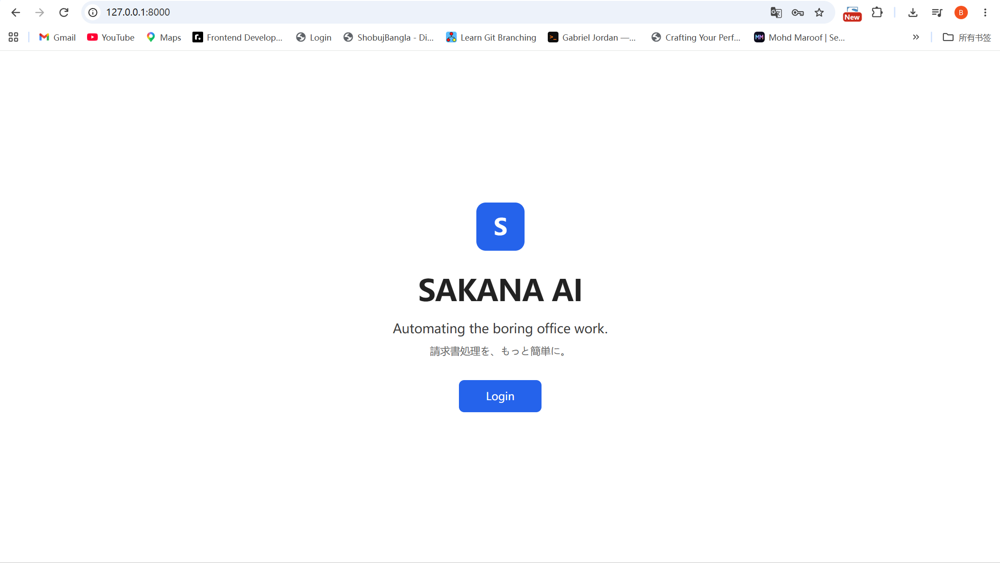
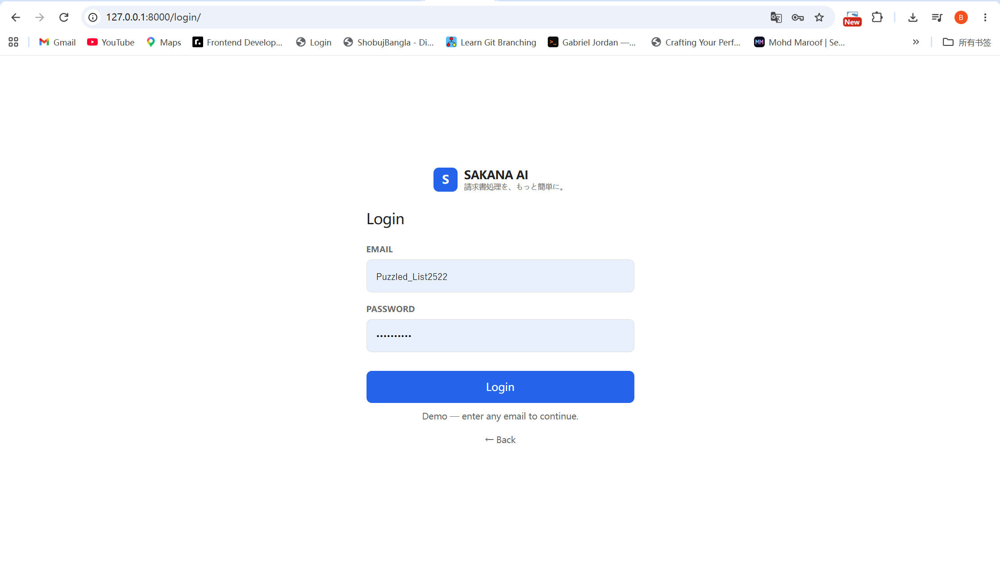
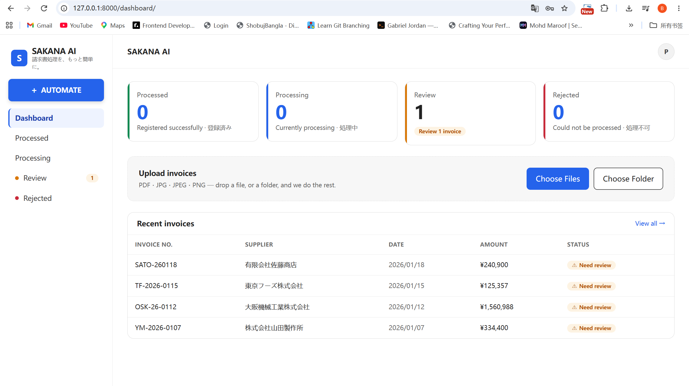
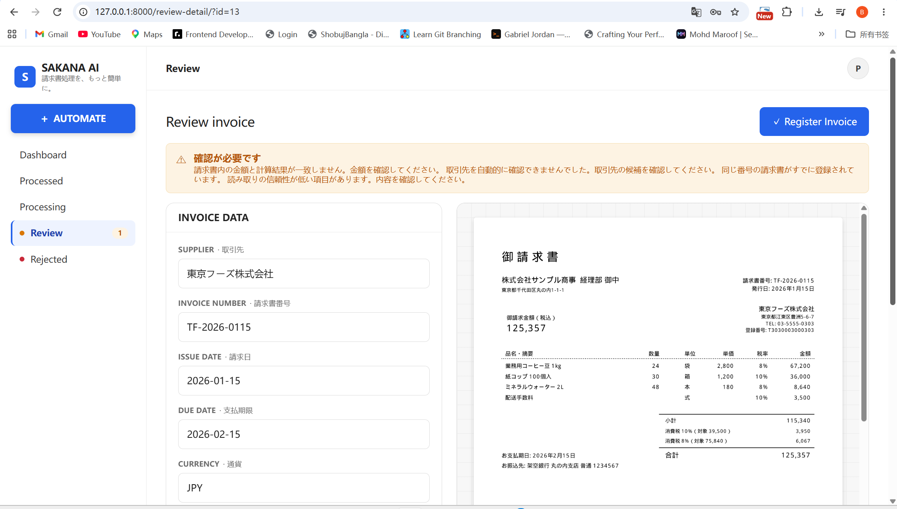
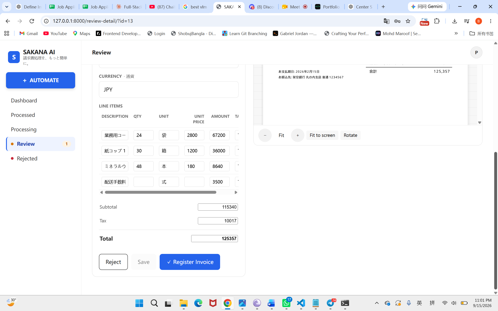
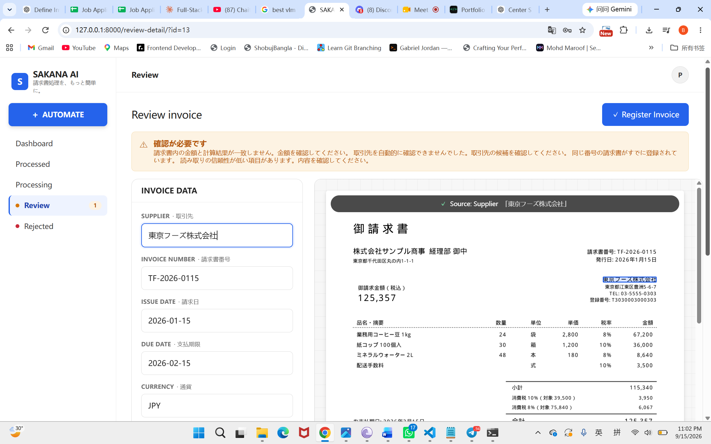
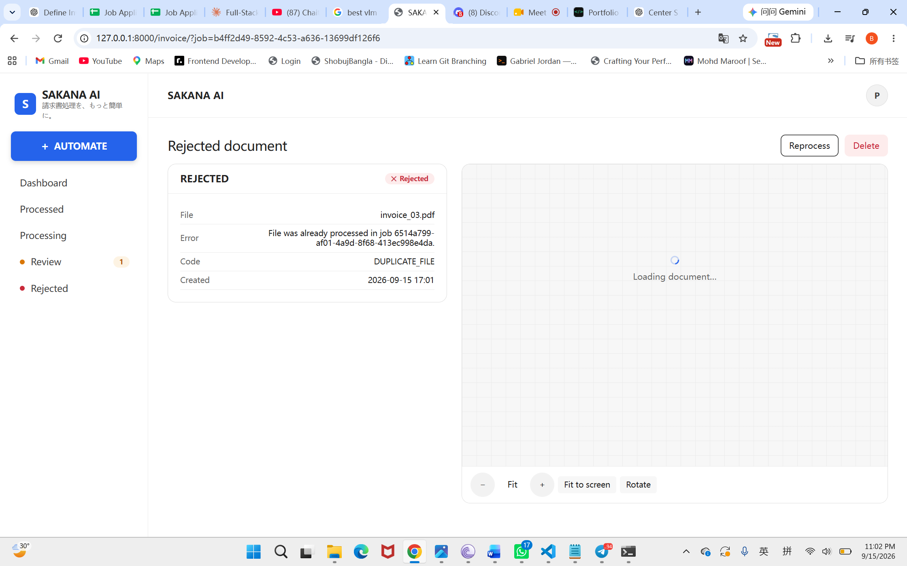

# Submission

- Name: Elman Pathan
- Submission date (YYYY-MM-DD): 2026-09-15
- Hours actually spent: ~8 hours
- Repository / how to run it:
  - Clone repository
  - Configure environment variables
  - Run backend
  - Run frontend
  - Open browser at localhost

---

## 1. Understanding the request

### Problem described by the client

The client's accounting staff manually enters invoice data into their accounting system. This process is time-consuming, requires overtime during month-end closing, and creates risk of human errors such as duplicate payments.

The client wants a way to automatically read invoices of varying formats and register them into the existing accounting system while continuing to use their current API.

### Problem I decided to solve

Rather than building a fully autonomous invoice registration system, I focused on building a reliable invoice intake workflow that:

1. Extracts invoice data from PDFs and scanned images.
2. Validates extracted information before registration.
3. Prevents duplicate registrations.
4. Routes uncertain cases to human review.
5. Integrates with the existing accounting API.

The primary goal was reducing manual effort while maintaining accounting accuracy.

---

## 2. What you would have asked the client

| What you wanted to ask                                           | The assumption you made                                                             | Why                                                         |
| ---------------------------------------------------------------- | ----------------------------------------------------------------------------------- | ----------------------------------------------------------- |
| What accuracy level is acceptable before automatic registration? | High-confidence invoices may be auto-registered, uncertain invoices require review. | Accounting systems require reliability.                     |
| How often do handwritten annotations occur?                      | Handwritten content exists but is not the majority of invoices.                     | Mentioned in requirements but volume unknown.               |
| What invoice volume is expected per month?                       | Approximately 1,000 invoices/month.                                                 | Needed for cost and scalability estimation.                 |
| Can supplier names vary from the master data?                    | Supplier names may contain aliases or formatting variations.                        | Real-world invoices rarely match perfectly.                 |
| Is human review acceptable before registration?                  | Yes. Human review is preferred over incorrect registration.                         | Accounting accuracy is more important than full automation. |
| Are duplicate uploads common?                                    | Duplicate uploads can happen and should be detected.                                | Client explicitly mentioned duplicate payment risk.         |
| Should failed invoices be retried automatically?                 | Failed invoices are sent to review instead of automatic retry.                      | Safer for accounting workflows.                             |
| Are scanned images generally high quality?                       | Image quality varies significantly.                                                 | Sample set contains scans and PDFs.                         |
| What SLA is required?                                            | Processing within a few seconds per invoice is acceptable.                          | No real-time requirement was specified.                     |
| Are there future multilingual requirements?                      | Current scope is Japanese invoices only.                                            | Assignment focuses on Japanese documents.                   |

Also,

How much is he willing to spend?
How many invoices per day？ highest QPS, lowest QPS, higest amount of invoices sent,
Is he willing to self-host LLM? or the office worker has a simple GPU ( for using self-hosted LLMs)
Does data privacy matter to him? Option for self-hosting

## But the biggest question is what is his budget and data privacy for self-hosting

## 3. Scoping decisions

### What you built

I prioritized the core invoice automation workflow:

- Invoice upload
- Image quality assessment
- Conditional preprocessing
- OCR extraction
- OCR validation
- Structured data extraction
- Supplier matching
- Schema validation
- Business validation
- Duplicate detection
- Human review workflow
- Accounting API registration

I also designed a review interface where users can compare extracted data against the original invoice before registration.

### What you left out, and why

#### Authentication system

A simple login screen is sufficient for the prototype.

#### Advanced role management

Not required to validate the invoice processing workflow.

#### Audit trail

Important in production but not essential for an 8-hour prototype.

#### ERP integrations beyond provided API

Out of scope.

#### Mobile-first experience

Target users are office staff working on desktop computers.

#### Advanced analytics dashboard

Useful later but lower priority than extraction accuracy.

---

## 4. Design and technology choices

### Architecture

```text
Invoice
    ↓
File Validation
    ↓
Image Quality Assessment
    ↓
Preprocessing (conditional)
    ↓
PaddleOCR
    ↓
OCR Validation
    ↓
Route Decision
       ├─ OCR Good → Text LLM
       └─ OCR Bad  → Vision LLM
    ↓
Structured JSON
    ↓
Schema Validation
    ↓
Business Validation
    ↓
Duplicate Detection
    ↓
Confidence Scoring
    ↓
Review Queue
       ├─ Approved → Accounting API
       └─ Rejected → Manual Fix
```

### Why this architecture

The architecture intentionally validates data at multiple stages before registration.

This reduces:

- Hallucinations
- Incorrect supplier mapping
- Amount mismatches
- Duplicate registrations

### OCR choice

PaddleOCR

Reasons:

- Open source
- Good multilingual support
- Works offline
- Strong Japanese OCR performance
- No per-document OCR cost

### LLM choice

A low-cost LLM for extraction and normalization.

Reasons:

- Handles varying invoice layouts.
- Extracts structured JSON.
- Supports Japanese invoices.

### Why not use only OCR?

OCR alone cannot reliably:

- Understand document structure
- Normalize fields
- Map suppliers
- Handle varying layouts

### Why not use only a Vision LLM?

Cost would be higher and structured validation becomes harder.

Using OCR first reduces cost while preserving flexibility.

---

## 5. How you used AI, and how you checked it

### What you delegated to AI

AI was responsible for:

- Extracting invoice fields
- Identifying supplier information
- Extracting line items
- Normalizing dates
- Structuring output JSON

### How you verified the output

I did not trust the extracted data blindly.

Validation layers included:

#### OCR validation

- Required field existence
- OCR confidence checks
- Format checks

#### Schema validation

- Required fields
- Data types
- Date formats
- Numeric fields

#### Business validation

- Due date after issue date
- Total amount consistency
- Tax validation
- Supplier matching

#### Duplicate validation

- Supplier + invoice number check
- Document hash check

#### Human review

Invoices with low confidence or validation issues are routed for review before registration.

### A case where the AI got it wrong

A supplier name may be extracted correctly but not exactly match the supplier master.

Example:

```text
Detected:
東京食品

Master:
東京フーズ株式会社
```

The system routes such cases to review rather than automatically registering them.

---

## 6. Integrating with the accounting system

### API constraints handled

#### Partner validation

Only valid partner codes are allowed.

Supplier names are matched against partner master data before registration.

#### Date validation

All dates are converted to:

```text
YYYY-MM-DD
```

#### Tax validation

Tax rates are converted into valid tax codes.

#### Amount validation

Totals are recalculated before registration.

#### Duplicate validation

Duplicate invoices are detected before API submission.

### Registration handling

| Invoice            | Result     | How you handled it            |
| ------------------ | ---------- | ----------------------------- |
| Valid invoice      | Registered | Sent directly to API          |
| Supplier mismatch  | Review     | Human confirmation required   |
| Duplicate invoice  | Rejected   | Duplicate detection triggered |
| Amount mismatch    | Review     | User correction required      |
| Unreadable invoice | Rejected   | User must upload new document |

---

## 7. Cost, limits, and risk in production

### Cost per invoice

Approximate:

```text
OCR: Free (PaddleOCR)
LLM Extraction: ~$0.001–0.01
Storage: negligible

Total:
~$0.01 per invoice
```

### Monthly cost at 1,000 invoices/month

```text
~$10/month
```

depending on model choice.

### Processing time per invoice

```text
Image validation: <1 sec
OCR: 1–2 sec + 2 min for cold start
LLM extraction: 1–3 sec

Total:
~2–5 seconds
```

### Where this breaks first

Most likely failure points:

- Poor quality scans
- Handwritten corrections
- Supplier matching ambiguity
- Large-scale concurrent processing

### How you would find out if something was registered incorrectly

Production monitoring should include:

- Human review logs
- Validation failure tracking
- Registration audit records
- Random invoice sampling
- Accounting reconciliation reports

---

## 8. What you would do with another 8 hours

### 1. Human review interface

Highest priority.

Provides visibility and correction before registration.

### 2. Confidence-based routing

Improve automation rates while maintaining accuracy.

### 3. Batch processing and background queue

Support larger invoice volumes and improve scalability.

### Screenshots

# Submission

## 4. Design and technology choices

### Architecture



The system uses OCR-first extraction with validation and human review.

### Login Page



Simple login page designed for office workers.

### Dashboard



Main dashboard showing processing statistics and upload actions.

### Processing Screen



Displays batch processing progress.

### Review Queue



Invoices requiring manual review.

### Review Detail



Side-by-side extracted data and original invoice.

### Registration Result



Successful registration confirmation.
